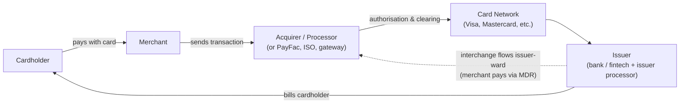

# 03 — Cards: Economics, Pricing & GTM

> **What you should be able to do after this chapter:** draw the card ecosystem and money flows from memory; build an issuer P&L; explain why transactors and revolvers are different businesses; describe every pricing lever on the issuer, acquirer, and network sides; and lay out the main card GTM plays and how an MBB team would run them.

---

## 1. The ecosystem



| Player | Role | How they make money |
|---|---|---|
| **Issuer** | Issues the card, extends credit, bears credit and fraud risk, owns the cardholder relationship | Interest, interchange, cardholder fees; net of rewards, credit losses, and funding cost |
| **Network (scheme)** | Rules, brand, switching, settlement | Scheme fees charged to issuers and acquirers (assessment, processing, cross-border); value-added services (fraud, tokens, data) |
| **Acquirer / merchant processor** | Signs merchants and processes their card acceptance | The merchant discount rate (MDR) minus interchange and scheme fees, plus ancillary fees and software |
| **PayFac / ISO / gateway / ISV** | Distribution and technology layers for merchant acceptance | A markup, revenue share, or software subscription |
| **Issuer processor** | Runs the issuer's card platform | Per-account and per-transaction fees |

**Four-party vs three-party:** Visa and Mastercard are *four-party* networks (issuer and acquirer are separate banks). American Express and Discover historically ran *three-party* ("closed-loop") models, being issuer, acquirer, and network at once, although both also partner with third-party issuers and acquirers. The Capital One–Discover combination (completed 2025) puts a large issuer in control of a network. That matters for network economics, including the ability to route its own debit (and over time more) volume onto its own network.

---

## 2. Following $100: the money flow (illustrative US consumer credit)

| Flow | Amount | Goes to |
|---|---|---|
| Customer pays | $100.00 | Merchant |
| Merchant discount rate (MDR) | −$2.40 (2.4%) | Deducted by the acquirer |
| └ Interchange | $1.90 (≈1.9%) | Issuer |
| └ Scheme / network fees | $0.14 | Network |
| └ Acquirer / processor margin | $0.36 | Acquirer (and ISO/ISV partners) |
| **Merchant receives** | **$97.60** | |

- **US credit interchange** ranges roughly from ~1.5% to ~3%+ depending on card type (premium rewards and commercial cards are higher), merchant category, card-present or card-not-present, and merchant size. The large merchants negotiate.
- **US regulated debit** (issuers ≥ $10bn assets) is capped under Durbin/Reg II at 21¢ + 0.05% + 1¢ fraud adjustment. A 2023 Fed proposal would lower this, so verify its status. That's why a $100 regulated-debit purchase earns the issuer only ~$0.27.
- **EU consumer** interchange is capped at **0.2% debit and 0.3% credit** (IFR), which is why EU issuers rely much more on fees and interest and offer much thinner rewards.

> **The strategic implication:** interchange funds rewards. In high-interchange markets (the US), rewards compete fiercely. In capped markets (the EU), card value propositions compete on fees, FX, and features instead.

---

## 3. Issuer economics

### 3.1 An illustrative US general-purpose credit card P&L (per $100 of average receivables)

| Line | Per $100 receivables | Driver |
|---|---|---|
| Interest income | 15.5 | ~22% APR × ~70% of balances interest-bearing (the rest are transactor and promo balances) |
| − Cost of funds | (4.0) | Funding rate × receivables |
| **= Net interest income** | **11.5** | |
| + Interchange | 5.4 | Spend of 3.0× receivables × ~1.8% net interchange |
| + Fees (annual, late, cash advance, FX, balance transfer) | 2.0 | Product design and customer behaviour |
| **= Gross revenue** | **18.9** | |
| − Rewards and partner payments | (3.6) | ~1.2% of spend |
| **= Net revenue** | **15.3** | |
| − Net credit losses | (4.0) | Net charge-off (NCO) rate (US card NCOs ran ~4%+ in 2024–25; verify) |
| − Operating expenses (marketing ~1.5, servicing, fraud, tech, network) | (6.0) | |
| **= Pre-tax income** | **5.3** | Pre-tax ROA ≈ 5%. Cards are among the highest-ROA products in banking |

**Key ratios management watches:** net revenue margin (net revenue ÷ average receivables), NCO rate, rewards rate (rewards ÷ spend), efficiency ratio, and **risk-adjusted margin** (net revenue − NCO).

### 3.2 Transactors vs revolvers: two different businesses

| (per account per year, illustrative) | **Transactor** (pays in full) | **Revolver** (carries a balance) |
|---|---|---|
| Annual spend | $24,000 | $6,000 |
| Average balance | $2,000 (no interest) | $5,000 at 24% APR |
| Net interest income | −$80 (funding the grace period) | $1,200 − $200 funding = **$1,000** |
| Interchange (1.9%) | $456 | $114 |
| Annual fee | $95 | $0 |
| Late fees | $0 | $40 |
| Rewards | −$360 (1.5%) | −$60 (1%) |
| Credit losses | −$10 | −$250 (5% of balance) |
| Servicing and operating cost | −$80 | −$100 |
| **Profit** | **≈ $21** | **≈ $744** |

**Insights for strategy:**
- **Transactor-heavy premium portfolios** live on **interchange and annual fees**. Rewards cost is their biggest lever, and breakage (unused benefits) is critical.
- **Revolver-heavy portfolios** live on **net interest margin and credit discipline**. Risk-based APR and underwriting are the key levers.
- Many portfolios cross-subsidise: revolvers fund the rewards of transactors. That creates political and regulatory attention on APR levels and fees.

---

## 4. Issuer pricing levers

| Lever | Typical structure | Strategic role | Constraints |
|---|---|---|---|
| **Purchase APR** | Variable (prime + margin), tiered by credit score at acquisition | The NII engine for revolvers | CARD Act: limits on raising the rate on existing balances, a 45-day notice for changes, penalty APR only after 60 days delinquent, periodic re-evaluation of increases. There are political proposals to cap APRs |
| **Promo / intro APR** | 0% for 12–21 months on purchases or balance transfers | Acquisition and balance growth | The cost of promo funding; "rate chasers" leave at the end of the promo |
| **Balance transfer (BT) fee** | 3–5% of the amount transferred | Recovers promo cost upfront | Competitive benchmark |
| **Annual fee** | $0 / ~$95 / ~$250–$395 / premium tier | Core revenue for transactor cards; signals positioning | Must be justified by benefits. US flagship premium cards moved annual fees into roughly the $800–900 range in 2025 refreshes, alongside expanded credits (verify current fees) |
| **Rewards earn rate** | Flat (1.5–2% cash back) or category multipliers (3–5× dining or travel) | The primary value proposition in the US | The rewards "arms race"; interchange caps limit it in the EU |
| **Rewards burn value** | Cents per point (1¢ cash; up to 1.5–2¢+ through transfer partners) | Where issuers manage cost: devaluation, redemption mix | Customer backlash when points are devalued; conduct |
| **Statement credits and benefits** | Dining, travel, streaming credits; lounge access | Premium "coupon book" value | Breakage assumptions; partner co-funding |
| **Late / returned-payment fee** | A fixed $ amount | Behavioural fee | CARD Act safe harbours. The CFPB's 2024 $8 late-fee rule was vacated in 2025, so the safe-harbour framework continues (verify current amounts) |
| **Foreign transaction (FX) fee** | 0–3% of the foreign spend | Revenue, or a differentiator: "no FX fees" is a premium and travel benefit | Transparency (EU CBPR2 for EU cards) |
| **Cash advance fee and APR** | 3–5% fee plus a higher APR | Risk pricing | Low-value use |
| **Credit line** | Line assignment and increases | Drives balances and spend; also exposure | Ability-to-pay rules; risk appetite |
| **Installment plans** | A fixed monthly fee instead of APR on selected purchases | Defends against BNPL | Disclosure rules |

### 4.1 Risk-based APR at acquisition (illustrative grid)

| Credit tier (at application) | Purchase APR (variable) | Initial line | Promo offer |
|---|---|---|---|
| Super-prime (760+) | Prime + 12% | $15–25k | 0% for 18 months |
| Prime (700–759) | Prime + 15% | $5–15k | 0% for 15 months |
| Near-prime (640–699) | Prime + 19% | $1–5k | 0% for 6 months |
| Subprime / thin-file | Prime + 22%+, or a secured card | $300–1,000 | None; a graduation path |

The grid is set by **risk-adjusted margin per tier**: expected NII + fees + interchange − rewards − expected loss − opex − capital. It is then tuned by elasticity and competitive position, and validated for fair lending.

### 4.2 Premium cards: the "coupon book" economics (illustrative)

| Item | Face value to customer | Issuer's net cost |
|---|---|---|
| Annual fee paid | — | **+$795** revenue |
| Statement credits (travel, dining, streaming, rideshare, and so on) | $1,500 | ~$450 after breakage (many credits go unused) and partner co-funding |
| Lounge access | "Priceless" | Cost per visit × visits (a significant and rising cost) |
| Points earned (e.g., 3–5× in categories) | ~$600 at 1.5¢+ per point | ~$400 at the issuer's cost per point |
| **The customer's perceived value** | **$2,000+** | |
| **The issuer's net** | | Fee $795 + interchange on ~$40k spend × ~2.2% (≈ $880) = ~$1,675 revenue. Less credits (~$450) and points (~$400), less lounge (~$100–150) and opex (~$150), leaves **≈ $500 per account**, driven by *affluent spend*. Credit losses are low because this is a transactor-heavy base |

**The game:** maximise *perceived* value relative to *actual* cost, through breakage, partner-funded credits, and category bonuses where the partner pays. At the same time, maintain genuine value, or face attrition at the fee anniversary and conduct scrutiny.

### 4.3 Test-and-learn pricing in cards

Card issuers randomise offers (APR, promo length, BT fee, bonus) across direct mail and digital cohorts. A typical design:

- **Champion:** the current offer
- **Challengers:** 3–5 variants
- **Measure:** response → approval → activation → 12-month NPV, *not* response rate alone
- **Guardrails:** fair-lending testing on outcomes by protected class (using proxies where needed for testing), and fair-value evidence

---

## 5. Commercial card pricing

**Products:** corporate travel and entertainment (T&E) cards, purchasing cards (P-cards), virtual cards (single-use numbers for AP), fleet cards, one-card programmes.

**Revenue:** commercial interchange (often higher than consumer, with large-ticket rates lower), annual or programme fees, late fees, and FX.
**Main cost:** **rebates to the corporate client**, which share interchange back. There is also credit risk (typically corporate liability) and supplier-enablement cost.

### 5.1 Illustrative rebate grid

| Annual programme spend | Base rebate (% of spend) | Speed-of-pay bonus (paid within ~7 days) |
|---|---|---|
| $1–5m | 0.50% | +0.15% |
| $5–25m | 0.80% | +0.20% |
| $25–100m | 1.10% | +0.25% |
| $100m+ | 1.30%+ (negotiated) | +0.30% |

**Pricing design choices:**
- **Incremental vs cliff tiers.** Cliffs create gaming and year-end disputes.
- **Rebate on "net" spend,** excluding large-ticket transactions and disputes.
- **Payment-terms adjustment:** longer terms mean a lower rebate, because the issuer funds the float.
- **Minimum spend commitments,** with claw-back if they are missed.

### 5.2 The virtual card / AP automation play

- The buyer pays suppliers by virtual card, which earns a rebate and extends days payable outstanding (DPO).
- The supplier pays the MDR, which is the friction. Supplier enablement campaigns tell the supplier that they get paid faster and with less collections effort.
- Some suppliers accept only with surcharging or at a negotiated large-ticket rate.
- **GTM:** bank treasury RMs cross-sell to existing AP clients. Fintech spend-management platforms embed virtual cards in AP software.

---

## 6. Merchant acquiring pricing

### 6.1 Pricing models

| Model | Structure | Target merchant | Pros | Cons |
|---|---|---|---|---|
| **Flat rate / blended** | e.g., ~2.6–2.9% + 10–30¢ (published fintech-style rates) | Micro and small | Simple, predictable | Overpays on debit, underprices premium cards and card-not-present |
| **Tiered (qualified / mid-qualified / non-qualified)** | Three buckets | Legacy SMB | Opaque and high margin | Declining; complaints; conduct risk |
| **Interchange-plus (IC+)** | Interchange passed through + scheme fees + markup (e.g., +0.20% + 8¢) | Mid-sized | Transparent, fair | Exposes margin; complex statements |
| **IC++ (enterprise)** | Interchange + scheme at cost + a negotiated markup in bps and per-auth fees | Large and enterprise | Most transparent | Thin margins |
| **Subscription / membership** | Interchange pass-through + a flat monthly fee | Growing SMB segment | Predictable; loyalty | Needs volume to justify |
| **Software-bundled** | SaaS fee + payments margin (payments often subsidise the software) | Vertical SMBs (restaurants, salons, retail) | Very sticky | Needs software capability |

### 6.2 Ancillary fees (often 15–30% of SMB acquiring revenue, and a leakage and conduct focus)

Statement or monthly minimums, PCI non-compliance fees, chargeback fees, terminal rental, early-termination fees, next-day funding fees, gateway fees.

### 6.3 Surcharging and cash discounting

- **US:** permitted in most states for credit (not debit), subject to network caps (Visa: up to 3%) and disclosure rules.
- **EU:** surcharging consumer cards is prohibited under PSD2.
- Surcharging shifts the merchant's cost-benefit, and "cash discount" programmes are part of SMB GTM for some ISOs.

### 6.4 The SMB repricing trade-off

Repricing the back book is one of the most common acquiring engagements. The core maths:

> **Net impact = (price uplift × retained volume) − (margin on volume lost to incremental churn)**

The design levers are *who* to reprice (exclude price-sensitive and high-value merchants), *what* to reprice (markup, fixed fee, or ancillary fees), *how to communicate* it (value messaging and notice periods), and *save desk* offers. Chapter 08, Case 5 works through the maths.

---

## 7. Network pricing (a brief view)

- **Scheme fees:** assessment fees (bps on volume), per-transaction processing fees, and **cross-border fees** (materially higher). Networks adjust these frequently.
- **Incentives:** networks pay large incentives to issuers and big merchants to win or keep volume (a contra-revenue line that runs to billions of dollars annually across the major networks). These drive **network-switch decisions** in issuer RFPs.
- **Value-added services (VAS):** fraud scoring, tokenisation, authentication, data and analytics, open banking, and account-to-account services. This is a growing share of network revenue and a pricing focus in itself.
- **Scrutiny (verify status):** US merchant–network interchange litigation and settlement attempts (a 2024 proposed settlement was rejected by the court), a DOJ antitrust suit against Visa over debit (2024), the proposed Credit Card Competition Act (routing mandates for credit), and UK PSR work on scheme and cross-border fees.

---

## 8. Card GTM strategies: the ten plays

### Play 1 — New consumer card launch (digital-first)

- **Situation:** a bank or fintech launching or relaunching a card to grow share.
- **Key choices:**
  - *Segment:* e.g., young professionals and cashback seekers vs affluent travellers vs credit-builders.
  - *Value proposition:* a flat 2% cash back? Category bonuses? No FX fee? Instant digital issuance with a virtual card in the wallet on approval?
  - *Channel mix:* existing-customer pre-approvals (lowest CAC), digital direct, aggregators (e.g., credit-comparison and credit-score platforms), affiliates, direct mail, branch.
  - *Pricing:* an APR grid, the promo, sign-up bonus economics (bonus cost vs incremental 12-month NPV).
- **Core analyses:** market map (offer teardown of 20–30 competitor cards), conjoint on rewards vs fee vs APR, channel CAC, funnel economics, credit cut-off vs approval-rate trade-off, 3-year cohort P&L.
- **Launch:** a pilot with existing customers → digital open market → scale channels with the best LTV:CAC.
- **KPIs:** approval rate, **"approve-to-swipe" activation within 30/90 days**, spend per active, top-of-wallet share, early delinquency.

### Play 2 — Co-brand and affinity partnership (win, renew, or switch)

- **The economics (who pays whom):**
  - Issuer → partner: **points or miles purchase** (the issuer buys the partner's currency, e.g., at ~1–1.5¢ per mile), **new-account bounties**, marketing funds, and sometimes a share of revenue or spend.
  - Partner → cardholder: loyalty value, status, and perks (free bags, discounts).
  - These deals are very valuable to partners. In 2020, US airlines raised financing secured on their loyalty programmes, with valuations in the tens of billions, largely reflecting co-brand card cash flows.
- **The RFP cycle:** partners typically run an RFP every 5–10 years. A switch triggers a **portfolio sale** to the new issuer, usually at a premium to receivables.
- **How MBB supports the *partner*:** programme valuation, RFP design, a bid evaluation model (the NPV of each bid under scenarios), negotiating non-financial terms (data rights, marketing commitments, service levels).
- **How MBB supports the *issuer*:** portfolio valuation (receivables, spend, losses, attrition on transfer), bid strategy (walk-away price, synergies with existing products), and integration and migration planning (conversion attrition, customer communications).
- **Risks:** **winner's curse** (overbidding), partner concentration, a contract term that shifts economics toward the partner at each renewal.
- **KPIs:** new accounts per partner channel (e.g., in-flight, at checkout, on the partner app), spend per card, partner payments as % of revenue, programme NPV.

### Play 3 — Premium and affluent

- **Value proposition:** lounges, travel credits, dining and lifestyle perks, status matches, concierge, experiences, and the "metal card" identity.
- **Pricing:** high annual fee + high earn rate + coupon-book credits, with a refresh every 2–4 years.
- **GTM:** existing affluent and wealth clients (bank and wealth cross-sell), digital, and invite-only tiers for exclusivity.
- **Key analyses:** benefit-level usage and cost (breakage), fee elasticity at renewal (the attrition curve after a fee increase), partner-funded credit opportunities, and lounge capacity and cost.
- **The classic engagement:** "Can we raise the annual fee from $X to $Y?" See Chapter 08, Case 2 for the attrition break-even.

### Play 4 — Credit-building, thin-file, and near-prime

- **Products:** secured cards (a deposit equals the limit), low-limit unsecured cards, cards underwritten on cash-flow data (bank-account data via open banking), "graduation" to unsecured.
- **Pricing:** little or no annual fee (regulatory and reputational scrutiny of fee-harvester cards), higher APR, low lines.
- **GTM:** partnerships with neobanks, employers, and community organisations; a credit-education content engine; tie-ins with credit-score apps.
- **Risks:** losses, fraud, conduct (fair value and affordability).

### Play 5 — Small business and commercial cards

- **Bank model:** RM-led cross-sell to business banking and treasury clients; rebates to mid and large corporates.
- **Fintech model:** spend-management platforms offer corporate cards **free**, funded by interchange, and monetise software (expense, AP, procurement) and float or treasury products. The GTM is PLG and inside sales, targeting startups and then the mid-market.
- **The bank response:** partner with or embed spend-management software; digitise onboarding; improve card controls.

### Play 6 — Debit and the "Durbin-exempt" model

- **The insight:** issuers with **under $10bn in assets** are exempt from the Durbin cap, so they earn much higher debit interchange.
- **The fintech GTM:** neobanks partner with exempt banks, earn exempt debit interchange, and offer "no-fee" accounts with early wage access funded by interchange. The GTM is D2C digital, payroll direct deposit as the hook, and referral.
- **Risks:** partner-bank regulatory scrutiny (BaaS), and any change to the exemption or the cap.

### Play 7 — Installments and BNPL-on-card (a defensive play)

- **Why:** BNPL providers intercept card spend at checkout.
- **Issuer response:** post-purchase installment plans in the app, pre-purchase installments via network credentials (e.g., flexible credentials that let one card work as debit, credit, or installments), and a fixed monthly fee instead of APR.
- **Pricing:** set the fee equivalent below the card APR to attract revolvers; model cannibalisation of interest income.

### Play 8 — Merchant acquiring GTM

| Segment | Dominant GTM | Pricing model | Winning capabilities |
|---|---|---|---|
| **Micro / small** | D2C digital, PLG (simple sign-up and a card reader), bank referral | Flat rate | Instant onboarding, hardware, simple software |
| **Vertical SMB** (restaurants, salons, retail) | **Embedded via ISVs** (payments inside vertical software), vertical-specific sales | Bundled SaaS + payments; IC+ | Vertical software and integrations |
| **Mid-market** | Inside and field sales, ISO and agent channels, bank referral | IC+ | Omnichannel, reporting, fraud tools |
| **Enterprise / global** | Field sales and RFP | IC++ with negotiated markup | Global acquiring licences, local acquiring (higher approval rates), optimisation (routing, tokens, retries) |

- **ISV / embedded GTM** is the fastest-growing acquiring channel. The acquirer or PayFac shares payment revenue with the software company. Pricing to the ISV (the revenue-share split) becomes the key commercial lever.
- **Bank-owned acquiring:** leverage the bank's SMB base through referral from business banking, with instant settlement to the bank's own account as a differentiator.

### Play 9 — Issuing-as-a-service, processing, and agent-bank programmes

- Sell issuing capability to fintechs (BIN sponsorship and processing) or to community banks and credit unions (agent-bank card programmes: the small bank brands the card; the large issuer carries the risk and shares revenue).
- **Pricing:** revenue share or per-account and per-transaction fees; a revenue split on interchange.
- **GTM:** field sales to FIs, channel partnerships with core-banking processors.

### Play 10 — Portfolio M&A and network strategy

- **Buy distribution:** acquire card portfolios (including co-brand portfolio transfers).
- **Network strategy:** network switches at contract renewal (driven by incentives and VAS), or owning the network (Capital One–Discover).

---

## 9. Card KPI tree

```
ROA / Risk-adjusted return
├── Net revenue margin
│   ├── NII: balances × (yield − cost of funds)  → revolve rate, APR mix, promo balances
│   ├── Interchange: spend × interchange rate     → actives, spend per active, category mix
│   ├── Fees: annual fee × fee-paying accounts; late fees; FX
│   └── (−) Rewards: earn rate × spend × cost per point; breakage
├── (−) Credit losses: NCO rate  → approval mix, line management, collections
└── (−) Opex: marketing (CAC), servicing, fraud, tech
Growth: new accounts, activation %, attrition %, top-of-wallet share, NPS
```

---

## 10. Mini-case: how an MBB team would attack a card pricing problem

**The client question:** *"Our flagship mid-tier rewards card is losing spend share, and its ROA has dropped 80 bps in two years. Fix it."*

1. **Diagnose (weeks 1–3):** decompose the ROA decline (PVM on NII, interchange, rewards, losses); run a cohort analysis (are new cohorts worse?); benchmark the offer against 25 competitor cards; map benefit usage and cost; run customer research (why are customers leaving or moving spend?).
2. **Hypotheses:** (a) earn rate uncompetitive in the top two spend categories; (b) rewards cost high because of a legacy redemption option at 1.25¢ per point; (c) annual fee waived for 40% of accounts by retention agents with no expiry; (d) promo APR attracting rate-chasers who leave.
3. **Design (weeks 4–8):** conjoint on 3–4 value-prop variants; redesign the rewards (category multipliers funded by removing low-value benefits); a retention-offer policy with guardrails; a new APR grid by risk tier; a transition plan for existing cardholders (grandfathering, notice periods, conduct review).
4. **Business case and roll-out (weeks 9–12):** a 3-year P&L with scenarios (attrition, spend lift); a test-and-learn plan (pilot the new offer to 10% of new applications); change management for the contact centre.
5. **Typical outcome (illustrative):** +40–60 bps ROA over 18–24 months, from rewards-cost optimisation, retention-offer discipline, and spend growth among engaged segments.

The full playbook format is in [07 — Engagement playbooks](07-engagement-playbooks.md#playbook-2--consumer-card-pricing--value-proposition-refresh).

---

## 11. Regulatory and market watch-list (verify current status)

- US debit interchange cap review (the 2023 Reg II proposal)
- The Credit Card Competition Act (credit routing) and any card APR cap proposals
- US merchant–network interchange litigation and settlements; the DOJ suit against Visa (debit)
- The CFPB's rulemaking posture (the late-fee rule was vacated in 2025; the broader agenda has shifted)
- The UK PSR on scheme and cross-border interchange; UK Consumer Duty fair-value reviews of card fees
- EU IFR review; PSD3/PSR; the digital euro (a potential competitor to card rails at the point of sale)
- Network tokenisation and passkeys (fraud economics), and stablecoin settlement pilots by the networks
- BNPL regulation (UK regulation of deferred payment credit; EU CCD2 from November 2026)
