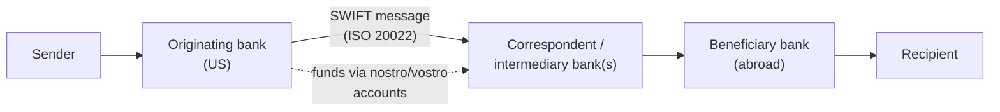
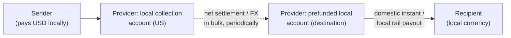

# 06 — Cross-Border Payments: Economics, Pricing & GTM

> **What you should be able to do after this chapter:** segment the cross-border market; draw the rails (correspondent banking, closed-loop networks, card rails, instant-payment linkages, stablecoins); break down the economics of a remittance and a B2B payment; design corridor-based pricing; and lay out the cross-border GTM plays.

---

## 1. Market segmentation

| Segment | Typical ticket | Key needs | Main providers | Pricing reality |
|---|---|---|---|---|
| **C2C remittances** (migrants sending home) | $100–500 | Low cost, trust, speed, convenient payout (cash, wallet, account) | Money transfer operators (MTOs: Western Union, MoneyGram, Ria), digital players (Wise, Remitly, WorldRemit and others), banks, wallets | A fee plus FX spread. Global average cost ~6%+ for a $200 transfer (World Bank), about twice the 3% SDG target. **Banks are typically the most expensive channel; digital-only the cheapest** |
| **C2B** (tuition, cross-border e-commerce, bills) | $50–20,000 | Reliability, reconciliation | Cards, specialist payment providers (e.g., education payments), wallets | Card FX fees or provider fees |
| **B2C payouts** (marketplaces, gig, creators, insurance) | $10–5,000 | Local-currency payout at scale, API, compliance | Payout platforms (e.g., Payoneer, Nium, Thunes, Airwallex, Rapyd), card push (Visa Direct, Mastercard Move) | Per payout + FX margin; revenue share with platforms |
| **B2B SME** (importers, exporters, e-commerce sellers) | $1k–100k | Cost transparency, speed, multi-currency accounts, accounting integration | Banks, fintechs (Wise Business, Airwallex, Revolut Business), brokers | Banks' FX margins are often 1–3%+; fintechs ~0.3–1% |
| **B2B corporate / treasury** | $100k–$100m+ | Liquidity, hedging, straight-through processing, global coverage | Global transaction banks | Negotiated spreads (single-digit to tens of bps in G10); hedging products |
| **Wholesale / FI** (correspondent banking, FX settlement) | Large | Clearing, liquidity, compliance | Global correspondent banks, CLS (FX settlement) | Per-payment fees + balances; FX |
| **Card-based cross-border** (travel and e-commerce spend) | $10–1,000 | Acceptance, FX fairness | Issuers, networks | FX fees (0–3%), network cross-border fees, **DCC** markups |

**Size:** remittances to low- and middle-income countries were about **$685bn in 2024** (World Bank), with **India the largest recipient**, followed by Mexico. Total cross-border flows, including B2B and wholesale, are commonly estimated in the **$150–250 trillion a year** range (estimates vary widely by definition). **Revenue** pools concentrate in FX spreads, SME and B2B, and card cross-border.

---

## 2. The rails

### 2.1 Correspondent banking (the traditional model)

- **Nostro / vostro:** "our account with you" / "your account with us". Banks hold prefunded balances in foreign currencies with correspondents, which ties up capital and liquidity.
- **Fee options:** **OUR** (the sender pays all fees), **SHA** (shared), **BEN** (the beneficiary pays, deducted in transit). Intermediary "lifting fees" often surprise recipients.
- **SWIFT gpi** added tracking and speed. Most gpi payments reach the beneficiary *bank* quickly, and the remaining delays concentrate in the "last mile" and in compliance checks.
- **ISO 20022:** SWIFT's MT/MX coexistence for cross-border payment instructions ended in November 2025, so richer structured data is now standard (verify local market-infrastructure timelines).
- **De-risking:** correspondent relationships have declined materially over the past decade (BIS data), especially for smaller and higher-risk jurisdictions. That raises costs and reduces access.

### 2.2 Closed-loop and "network" models (MTOs and fintechs)

- The money doesn't actually "cross the border" per transaction. The provider **collects domestically and pays out domestically** from prefunded local accounts, and settles or hedges in bulk.
- **Advantages:** speed (local instant rails), cost (bulk FX, fewer intermediaries), transparency.
- **Requirements:** licences in each market, local bank partners, liquidity management, and compliance at scale.

### 2.3 Card rails (push-to-card and account)

- Visa Direct and Mastercard Move offer push payments to cards, accounts, and wallets across many countries, using the networks' reach and settlement.
- They are used for remittances, payouts, and P2P. Pricing is typically per transaction plus FX.

### 2.4 Instant-payment linkages

- Bilateral links (e.g., Singapore PayNow–India UPI, 2023; various ASEAN QR linkages).
- **Project Nexus** (originally BIS): a multilateral model to connect domestic instant-payment systems, now being taken forward by participating central banks (verify status).
- UPI International: Indian users paying abroad via UPI QR acceptance at partner merchants.

### 2.5 Stablecoins and blockchain rails

- **Flow:** fiat → stablecoin (on-ramp) → blockchain transfer (near-instant, 24/7) → stablecoin → local fiat (off-ramp) → payout.
- **Use cases gaining traction:** B2B payments in emerging markets with dollar scarcity, treasury movements between entities, payouts to crypto-enabled wallets, and settlement between fintechs and PSPs.
- **Economics:** transfer cost is low; **costs concentrate in on- and off-ramps** (spreads, local banking partners), compliance (KYC, the Travel Rule, sanctions screening), and liquidity in local currencies.
- **Regulation:** the US **GENIUS Act** (2025) established a federal framework for payment stablecoins. The EU's **MiCA** has been fully applicable since end-2024. Other regimes are evolving in the UK, Singapore, Hong Kong, and the UAE (verify details).
- **Bank-led tokenised deposits and settlement networks** (e.g., JPMorgan's Kinexys, formerly Onyx) target institutional and cross-border treasury flows.

### 2.6 International policy targets (G20 Cross-Border Payments Roadmap, 2027)

| Dimension | Target (by end-2027, simplified) |
|---|---|
| **Cost** | Remittances: global average ≤ 3%, with no corridor above 5%. Retail: average ≤ 1% |
| **Speed** | 75% of payments credited within one hour; the rest within one business day |
| **Access** | All end-users have at least one option for sending and receiving cross-border payments |
| **Transparency** | All PSPs disclose a minimum set of information (total cost, FX rate, time, terms) |

The FSB's progress reports show many targets are **off track** (verify the latest). This is a regulatory tailwind for transparency and competition, and a pricing constraint for incumbents that rely on opaque spreads.

---

## 3. Economics

### 3.1 Where the money comes from

| Revenue line | Description | Share of revenue (typical direction) |
|---|---|---|
| **FX spread (markup)** | The difference between the customer rate and the mid-market or interbank rate | **Often the largest component**, especially in banks and "zero-fee" offers |
| **Explicit fees** | Flat or % transfer fee | Material for small tickets |
| **Intermediary / lifting fees** | Fees deducted by correspondents | Declining (transparency, gpi) |
| **Hedging and forwards** | Forward points margin, options premiums | Corporate and SME importers and exporters |
| **Float / balances** | Interest on customer or prefunding balances | Significant when rates are high |
| **Value-added services** | Multi-currency accounts, virtual IBANs, collection accounts, payroll | Growing (SME and platforms) |

### 3.2 Illustrative unit economics: a $200 digital remittance (bank-account funded)

| Line | $ | Notes |
|---|---|---|
| Fee | 2.99 | |
| FX margin (1.0% of $200) | 2.00 | |
| **Revenue** | **4.99** | 2.5% all-in cost to the customer |
| Payout partner fee | (0.75) | Bank account, wallet, or cash pickup (cash is higher) |
| Funding cost (bank debit / ACH) | (0.25) | **A card-funded transfer would cost ~$2+ here** |
| FX, liquidity, and hedging cost | (0.20) | Prefunding capital and hedging |
| Compliance, KYC, and fraud | (0.40) | Screening, monitoring, losses |
| Service and tech | (0.50) | |
| **Contribution per transfer** | **≈ 2.89** | |
| CAC | $30–60 | Paid digital, referral |
| **Payback** | ~10–20 transfers | Monthly senders pay back in about 1–1.5 years; **retention is everything** |

**Pricing implications:**
- **Funding method** must be priced (a card-funded transfer is costlier).
- **Payout method** must be priced (cash pickup is costliest).
- **The first transfer** can be a loss-leader if repeat behaviour is strong.
- **Ticket size:** a flat fee dominates cost for small tickets, and the spread dominates for large ones.

### 3.3 Illustrative: a $50,000 SME supplier payment (USD → EUR)

| Provider type | FX margin | Fees | Total cost | % |
|---|---|---|---|---|
| Traditional bank (standard tariff) | 2.5% ($1,250) | Wire $45 + intermediary deduction ~$25 | ~$1,320 | ~2.6% |
| Bank (negotiated, mid-sized client) | 0.75% ($375) | $25 | ~$400 | ~0.8% |
| Fintech (transparent pricing) | ~0.4–0.6% | Small fixed fee | ~$225–300 | ~0.5% |
| Large corporate (RFQ platform) | 5–20 bps | Minimal | ~$25–100 | ~0.1% |

**The insight:** SMEs are the **most mispriced and most contestable** segment. Banks earn high FX margins from unsophisticated SMEs who don't benchmark, and fintechs attack exactly here. This is one of the most common cross-border strategy engagements.

---

## 4. Pricing strategies in cross-border

### 4.1 Architecture choices

| Choice | Option A | Option B | Considerations |
|---|---|---|---|
| **Fee vs spread** | Transparent: mid-market rate + an explicit fee | Spread-based: "zero fee" with a marked-up rate | Regulation (EU CBPR2 disclosure, US Remittance Rule, G20 transparency) is pushing toward A. B still dominates many bank tariffs |
| **Uniform vs corridor-based** | One global price list | Price each corridor separately | Corridors differ hugely in competition, cost, and liquidity, so **corridor-based wins** |
| **Static vs dynamic** | Fixed tariffs | Dynamic by volatility, time, and liquidity | Dynamic is common in fintechs; needs guardrails and transparency |
| **Per-transaction vs subscription** | Pay per transfer | Monthly plan with lower FX | Subscriptions suit frequent SME users and premium retail plans |

### 4.2 An illustrative remittance price grid (one corridor)

| Send amount | Bank-account funded, to bank account (economy, 1–2 days) | Bank funded, instant to wallet or account | Debit-card funded, instant | Cash pickup |
|---|---|---|---|---|
| $0–100 | $1.99 + 0.8% FX | $2.99 + 0.8% | $3.99 + 0.8% | $4.99 + 1.2% |
| $100–500 | $2.99 + 0.7% | $3.99 + 0.7% | $4.99 + 0.7% | $5.99 + 1.0% |
| $500–2,000 | $3.99 + 0.5% | $4.99 + 0.5% | $6.99 + 0.5% | $7.99 + 0.8% |
| $2,000+ | $0 + 0.4% | $2.99 + 0.4% | Not offered (card limits and cost) | $9.99 + 0.7% |

**Plus:** first transfer free or at a promotional FX rate (with the full cost disclosed); a referral credit (e.g., "give $20, get $20"); loyalty tiers for frequent senders.

### 4.3 Corporate and SME FX pricing tiers (bank, illustrative)

| Annual FX volume | G10 spot margin | EM currency margin | Notes |
|---|---|---|---|
| < $1m | 150–300 bps | 250–500 bps | This is where fintech disruption concentrates |
| $1–10m | 75–150 bps | 150–300 bps | |
| $10–100m | 25–75 bps | 75–150 bps | Relationship-priced |
| > $100m | 5–25 bps | 25–75 bps | RFQ and electronic platforms; transaction cost analysis (TCA) scrutiny |

**The classic MBB finding in an FX pricing diagnostic:** margins vary 3–5× *within* the same tier, driven by RM discretion and client inertia rather than value or risk. The prize is **realisation and governance**, plus defending the most-exposed SME clients before fintechs take them.

### 4.4 Other pricing levers

- **Hedging products:** forward points plus a margin (plus a credit line cost); options premiums. SME hedging is under-penetrated, so it's an opportunity.
- **Multi-currency accounts:** account fees, receiving details (virtual IBANs), conversion fees.
- **Platform and embedded FX:** a **revenue share** with marketplaces (the platform adds a markup; the provider gets a wholesale margin).
- **White-label / wholesale:** selling FX and payouts to other banks and fintechs at wholesale spreads plus a per-transaction fee.
- **Card FX:** foreign transaction fees (0–3%) as a revenue line *or* a premium differentiator ("no FX fees"). **DCC** (dynamic currency conversion, where the merchant offers to charge in your home currency) often carries a much higher markup; EU CBPR2 requires disclosure of the markup against the ECB reference rate.

---

## 5. Compliance and licensing: the hidden GTM constraint

| Jurisdiction | Typical licence to offer money transfer / payments |
|---|---|
| **US** | State **money transmitter licences** (MTLs) in nearly every state, plus FinCEN MSB registration. Timelines and bonding are material. The Remittance Transfer Rule (disclosures, error resolution, cancellation rights). A **1% federal excise tax on cash-funded remittances** from January 2026 (transfers funded from bank accounts or US-issued cards are exempt), which accelerates cash-to-digital migration |
| **EU** | Payment Institution or E-Money Institution licence, **passportable** across the EEA |
| **UK** | FCA authorisation as a payment institution or EMI |
| **Singapore** | MAS Major Payment Institution licence |
| **Destination markets** | Local partners or licences for payout; FX controls (e.g., in some African and Asian markets) |

**Also:** KYC/AML programmes, sanctions screening (sanctions regimes have expanded and grown more complex since 2022), fraud controls, the Travel Rule for crypto, and data-localisation rules.

> **GTM implication:** licences and payout partners take **12–24+ months** to build. That's why **partner-led entry** (use a licensed partner) and **acquisitions of licensed players** are common entry modes (see [02 §3.17](02-gtm-strategy-fundamentals.md#317-geographic-market-entry-modes)).

---

## 6. Cross-border GTM strategies: the twelve plays

### Play 1 — Corridor-led expansion (the prioritisation engine)

**Score each candidate corridor** on attractiveness and ability to win. The scores below are illustrative, not market data.

| Corridor (illustrative) | Flow size | Growth | Price headroom | Digital adoption | Competitive intensity (5 = low) | Payout infrastructure | Our ability to win | **Priority** |
|---|---|---|---|---|---|---|---|---|
| US → Mexico | 5 | 3 | 1 | 3 | 1 | 5 | 3 | Defend / selective |
| US → India | 5 | 4 | 2 | 5 | 2 | 5 | 4 | **High** |
| UK → India | 4 | 4 | 3 | 5 | 3 | 5 | 4 | **High** |
| UAE → India / Pakistan | 5 | 4 | 3 | 4 | 3 | 4 | 2 | Partner-led |
| EU → Sub-Saharan Africa | 3 | 5 | 5 | 3 | 4 | 3 | 3 | **High (build)** |
| US → Philippines | 4 | 3 | 2 | 4 | 2 | 4 | 3 | Medium |

**Principles:**
- **Big, competitive corridors** (e.g., US → Mexico) have thin margins, so you win on cost and scale or stay out.
- **High-cost corridors** (Sub-Saharan Africa is typically the most expensive region to send to) offer price headroom but need payout-infrastructure investment.
- **Sequence** corridors so that each new corridor reuses licences, payout partners, and diaspora marketing.

### Play 2 — Digital D2C remittance (diaspora marketing)

- **Acquisition:** diaspora-targeted digital (language, culture), **community ambassadors**, **festival and seasonal campaigns** (e.g., Diwali, Eid, Christmas, Lunar New Year, back-to-school), referral programmes, app store optimisation, comparison sites.
- **Trust building:** speed guarantees, transparent pricing, reviews, customer service in native languages.
- **Retention:** saved recipients, rate alerts, loyalty pricing, scheduled transfers.
- **Expansion (land-and-expand):** wallets, cards, savings, and credit for migrants (credit-building using remittance history).
- **KPIs:** CAC by channel and community, first-to-second-transfer conversion, monthly active senders, transfers per sender, principal per sender, take rate.

### Play 3 — Omnichannel: the cash-to-digital migration

- **Situation:** legacy MTOs with large agent networks face digital attackers.
- **The play:** keep the agent network as a trust and cash on-ramp and off-ramp, and **migrate customers to digital** (app registration at the agent, digital send with cash pickup, digital-to-wallet).
- **Pricing:** lower prices for digital send to encourage migration; cash pricing reflects cost. The **US 1% excise tax on cash-funded remittances** (from 2026) adds a pricing reason to migrate.
- **Agent economics:** renegotiate commissions and repurpose agents for cash-in and cash-out services.

### Play 4 — SME cross-border (multi-currency accounts and integrations)

- **The proposition:** "Collect and pay globally like a local": multi-currency accounts, local receiving details in major currencies, cheap and transparent FX, cards for spending in foreign currencies, **accounting-software integration** (automatic reconciliation), and bulk payouts.
- **GTM:**
  - **PLG / digital:** self-serve sign-up, transparent pricing calculators, free tier plus paid plans.
  - **Partner channels:** accounting software marketplaces, e-commerce and marketplace seller programmes (collecting marketplace proceeds in local currencies), trade associations, accountants.
  - **Bank response:** a digital FX platform for SMEs; **reprice the most-exposed segment proactively** (see §4.3); bundle FX into SME packages.
- **KPIs:** active SMEs, cross-border volume per SME, take rate, attach of cards and accounts, churn to fintechs.

### Play 5 — Corporate treasury: global payments and FX (RM-led)

- **The proposition:** global coverage, liquidity management (cash pooling, sweeps), FX execution and hedging, straight-through processing, ISO 20022 data, instant payouts in key markets.
- **GTM:** coverage bankers + treasury and FX specialists; RFP-led; wallet-sizing per client; cross-sell from lending (see [04 §4](04-lending.md#4-commercial-and-corporate-deal-pricing-and-raroc)).
- **Pricing:** negotiated FX margins (TCA-benchmarked), per-payment fees, balance-based pricing, a pricing committee for large mandates.

### Play 6 — Platform payouts and embedded FX (API-led)

- **Clients:** marketplaces, gig platforms, creator platforms, travel platforms, insurers with global claims, e-commerce platforms.
- **The proposition:** one API to pay out in 100+ countries and currencies, with local rails, compliance handled, and FX at a wholesale rate that the platform can mark up.
- **GTM:** developer-first (documentation, sandbox), platform partnership teams, revenue share (the platform earns on FX and payouts).
- **Pricing:** per payout (varying by rail and country) + FX margin + a revenue share with the platform.

### Play 7 — B2B2X: cross-border-as-a-service for banks and fintechs (white-label)

- **Model:** a scale provider (a fintech or a global bank) powers cross-border for other banks and fintechs, which keep the customer relationship and brand. Transparent-pricing fintechs have signed banks as platform clients.
- **For the *seller*:** wholesale distribution at scale. **For the *buying* bank:** fast time-to-market, competitive pricing, and the ability to retire costly correspondent chains.
- **Pricing:** wholesale FX spread + per-transaction fee; the buying bank sets its retail markup.
- **Risks:** the bank's dependence on a potential competitor, data sharing, and compliance-accountability allocation.

### Play 8 — Correspondent banking and the FI business

- **Model:** global banks provide clearing, nostro accounts, and FX to other banks (respondents).
- **The strategic trend:** **rationalise** (de-risking; exiting low-value, high-risk relationships) and **reposition** (value-added services for respondents: gpi tracking, compliance utilities, liquidity, FX).
- **Pricing:** per-payment fees, account maintenance, balance requirements, FX spreads; price by risk (the cost of compliance).
- **GTM:** FI coverage team; tiering of respondents by value and risk.

### Play 9 — Card-based cross-border

- **Issuer side:** "No FX fee" travel cards as an acquisition hook for affluent and travelling segments; travel-card bundles; multi-currency cards.
- **Network side:** cross-border fees and FX are a major network revenue pool; push-to-card and account (Visa Direct, Mastercard Move) for remittances and payouts.
- **Acquirer side:** multi-currency pricing for merchants (letting shoppers pay in their own currency), local acquiring for approval rates, DCC (with transparency constraints).

### Play 10 — Stablecoin and tokenised-money rails

- **Where it's credible today:** B2B payments into and out of emerging markets with dollar access issues; fintech-to-fintech settlement; treasury movements among a multinational's entities; payouts to crypto-native recipients.
- **GTM for a bank or fintech:**
  1. Start with **treasury and settlement use cases** (internal or partner flows), not retail.
  2. Partner with regulated stablecoin issuers and on- and off-ramp providers in target corridors.
  3. Build compliance (the Travel Rule, sanctions, wallet screening) and an accounting treatment.
  4. Price at a clear discount to the correspondent-bank alternative, with the speed guarantee as the value.
- **Risks:** regulatory divergence across jurisdictions, off-ramp liquidity, reputational risk, operational risk (key management).

### Play 11 — Instant-payment linkages and "UPI-style" international acceptance

- **Examples:** accepting UPI QR payments from Indian tourists at partner merchants abroad; bilateral instant links (e.g., PayNow–UPI); multilateral links via Nexus-type arrangements.
- **GTM:** partnerships with national schemes, acquirers, and travel-heavy merchants (duty free, hotels, tourist retail).
- **Pricing:** merchant-paid (below card cross-border fees), plus FX margin.

### Play 12 — Inorganic: buy licences, networks, or payout reach

- Acquire licensed players (MTOs, EMIs, payout networks) to enter corridors fast; acquire technology (FX engines, compliance tooling).
- **CDD angle:** diligence corridor concentration, take-rate sustainability (vs transparent competitors), licence quality, compliance history (enforcement actions are common in the sector), and customer cohort retention.

---

## 7. Sample engagement: "We're losing SME FX to fintechs" (a European bank)

**The client question:** *"Our SME cross-border revenue fell 12% in two years, while fintechs are growing 30%+ a year among our clients. What do we do?"*

| Weeks | Activities | Outputs |
|---|---|---|
| 1–3 | **Diagnostic:** transaction-level FX margin analysis (realised spread by client, tier, currency, channel); wallet-leakage analysis (outgoing payments from our SME accounts to fintech accounts, a proxy for lost wallet share); competitor price benchmarking; 20 SME interviews and a survey (switching drivers) | FX margin dispersion map; share of wallet lost; "why SMEs switch" (price transparency, speed, UX, multi-currency accounts) |
| 4–6 | **Pricing redesign:** a transparent tiered pricing structure; defensive repricing for the most-exposed segments (high-volume, digitally savvy SMEs); a hedging proposition for importers and exporters; elasticity and scenario modelling (revenue impact of lower margins vs retained and regained volume) | New SME FX price book; business case (short-term revenue dip vs 3-year recovery) |
| 7–9 | **Proposition and GTM:** a digital FX platform (build vs partner vs white-label, e.g., using a fintech's cross-border engine), multi-currency accounts, accounting integrations; RM and inside-sales campaign for at-risk clients; digital acquisition | Target proposition; GTM plan; partner evaluation |
| 10–12 | **Implementation plan:** pricing governance (DoA for FX margins), MI (realised spread, win-back rate), pilots, roadmap | Roadmap, KPI dashboard, pilot launch |

**A typical answer headline:** *"Stop the bleeding with transparent tiered pricing for the top 20% most-exposed SMEs (which accepts a margin drop to protect the wallet), launch a white-labelled multi-currency proposition within 6 months, and use RM-led hedging advice as the differentiator fintechs can't easily match."*

---

## 8. Cross-border KPIs

- **Volume:** principal by corridor and segment; transactions; active senders or clients
- **Revenue:** take rate (bps); revenue per transaction; FX margin realisation; mix (fees vs spread)
- **Growth:** CAC, first-to-second-transfer conversion, retention cohorts, LTV:CAC
- **Speed and quality:** % credited instantly or within 1 hour; payout success rate; repair and exception rate
- **Cost:** cost per transaction; liquidity cost (prefunding); payout partner costs
- **Compliance:** alert volumes, false-positive rate, time to clear, regulatory findings
- **Competitive:** price position vs benchmark providers per corridor; share of SME wallet

---

## 9. Cross-border watch-list (verify current status)

- Progress against the G20 2027 targets (FSB annual progress reports); cost, speed, and transparency pressure
- The US remittance excise tax (1% on cash-funded transfers from 2026) and any changes
- Stablecoin regulation (the GENIUS Act implementing rules; MiCA; UK, Singapore, Hong Kong, and UAE regimes) and bank-issued tokenised deposits
- Instant-payment linkages (Nexus and bilateral links), UPI international expansion
- SWIFT's post-ISO 20022 initiatives (e.g., retail cross-border schemes and pre-validation), and correspondent de-risking trends
- EU PSD3/PSR and CBPR2 enforcement on FX transparency; UK PSR cross-border interchange measures
- Sanctions complexity and its impact on corridors and costs
